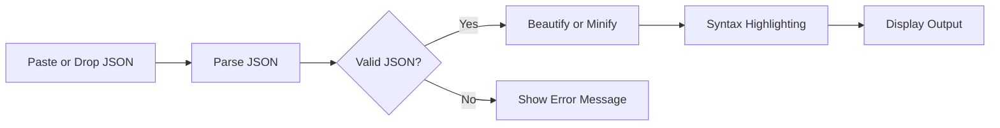
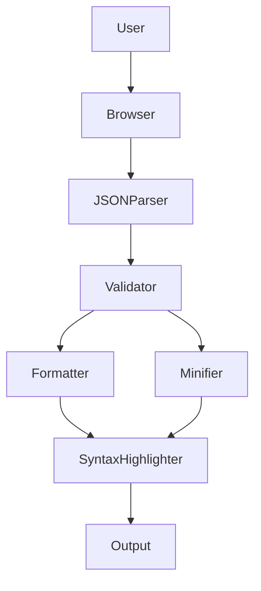

# ⚡ JSON Formatter

### A fast, privacy-first JSON Formatter, Validator & Minifier

Format, validate, beautify, and minify JSON instantly—all inside your browser. No servers, no uploads, no dependencies.

---

## ✨ Overview

JSON Formatter is a lightweight, browser-based utility designed to simplify working with JSON data. Whether you're debugging APIs, inspecting payloads, or formatting configuration files, the application delivers a fast and responsive experience without requiring installation, build tools, or an internet connection.

Everything runs locally inside your browser, ensuring your data never leaves your machine.

---

## 🚀 Features

- ⚡ Instant JSON formatting with proper indentation
- ✅ Built-in JSON validation with precise error reporting
- 🎨 Clean syntax highlighting for improved readability
- 📦 One-click JSON minification
- 📁 Drag-and-drop support for `.json` files
- 🔒 100% client-side processing
- 🌐 Works completely offline
- 🚀 Zero dependencies
- 💻 Compatible with all modern browsers

---

## 🎯 Use Cases

- API response inspection
- Request payload formatting
- Configuration file editing
- JSON debugging
- Data validation
- Learning and teaching JSON
- Development and testing workflows

---

## ▶️ Getting Started

Simply open the application in any modern web browser.

No installation, package manager, build process, or configuration is required.

---

## ⚙️ Processing Flow

The application performs every operation directly inside the browser.

---

## 🏗 Architecture

---

## 🔒 Privacy

JSON Pretty is designed with privacy as a core principle.

- No data uploads
- No cloud processing
- No analytics
- No tracking
- No external APIs
- No user information collected

Every operation is performed locally within your browser.

---

## ⚡ Performance

- Single-file application
- Instant startup
- Lightweight footprint
- Zero runtime dependencies
- Efficient native browser execution

---

## 🛠 Technology Stack

| Technology | Purpose |
|------------|---------|
| HTML5 | Application Structure |
| CSS3 | Responsive User Interface |
| Vanilla JavaScript (ES6+) | JSON Processing & Logic |

---

## 🌍 Browser Support

- Google Chrome
- Microsoft Edge
- Mozilla Firefox
- Safari
- Brave
- Opera

---

## 📄 License

This project is licensed under the **MIT License**.

---

Made with ❤️ for developers.

